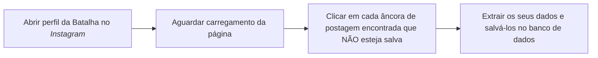
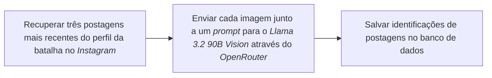
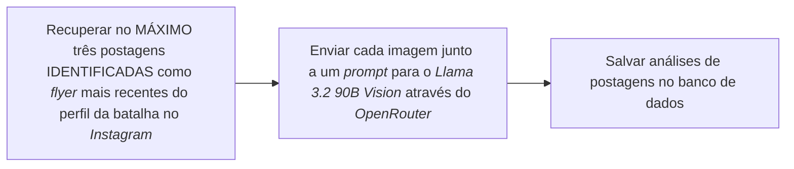
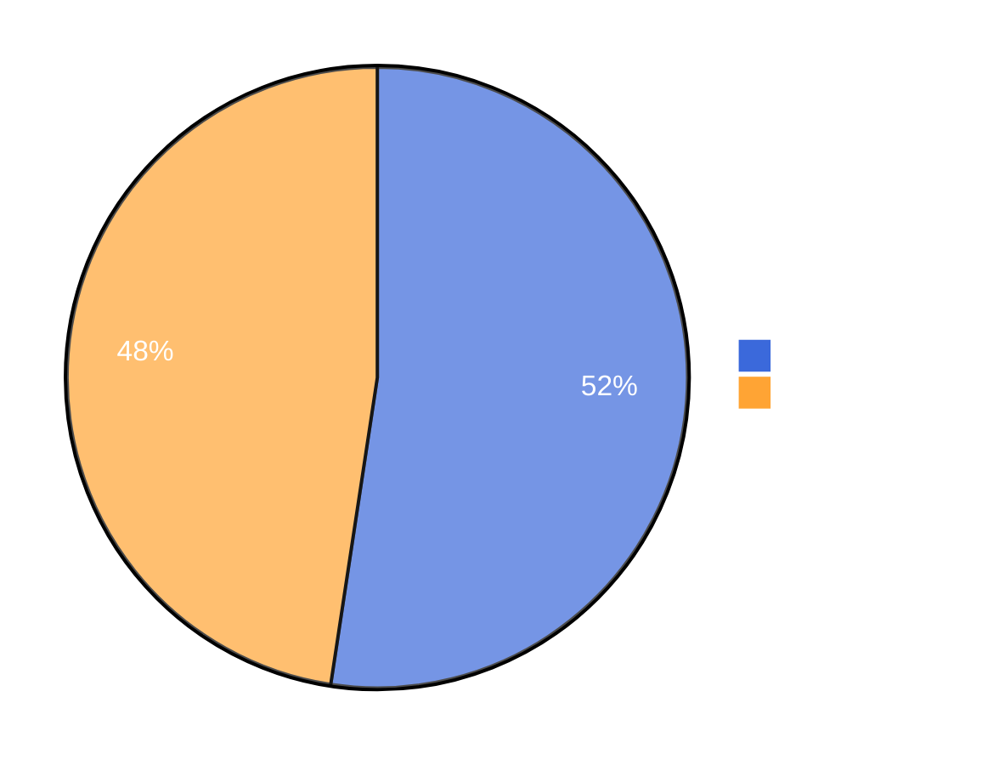
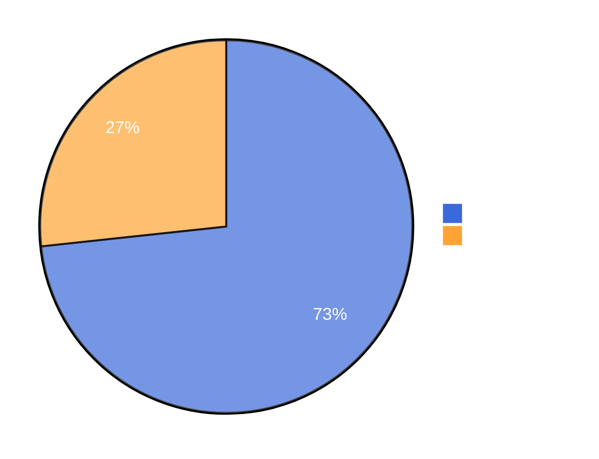

# Extração de Texto de Panfletos Digitais em Mídias Sociais Utilizando Modelo Multimodal

#### Eric Stefano dos Santos Lima

#### Orientador: Felipe Augusto Lima Reis

---

# Introdução

## Contexto

- Ascensão das mídias sociais na disseminação de informações
- Batalhas de rima e eventos culturais

## Motivação

- Popularização do uso de redes sociais
- Dados disponíveis exclusivamente nestas plataformas
- Dados em formatos não estruturados
- Preservação e visibilidade

---

# Introdução
<div class="grid grid-cols-2 min-h-full">
<div>

<Author class="mt-2">Fonte: @_batalhadocoreto_ via <em>Instagram</em>.</Author>
</div>
<div>

<Author class="mt-2">Fonte: @duelonacional e @familia_de_rua via <em>Instagram</em>.</Author>
</div>
</div>

---

# Objetivos

## Objetivo Geral

- Desenvolver um sistema para extração de informações sobre batalhas de rima no <em>Instagram</em>

## Objetivos Específicos

- Cadastro e gerenciamento de batalhas de rima
- Mapa interativo
- <em>Web scraping</em> de postagens do <em>Instagram</em>
- Identificação e extração de informações com <em>LLM</em> multimodal

---

# Metodologia

## Arquitetura do Sistema

- Monolito
- Módulo de Extração de Postagens
- Módulo de Análise de Postagens
- Módulo de Exibição

## Tecnologias Utilizadas

- <em>Node.js</em> e <em>TypeScript</em>
- <em>Vue.js</em> e <em>Nuxt.js</em>
- <em>Crawlee</em> e <em>Playwright</em>
- <em>OpenRouter</em> e <em>Llama 3.2 90B Vision</em>

---

# Arquitetura

<h2 class="mb-4">Visão Geral</h2>

<div class="flex flex-col">
  
  <Author class="mt-3">Fonte: Próprio autor.</Author>
</div>

---

# Módulos

<h2 class="mb-4">Extração de Postagens</h2>



<v-click>
```ts {|2,3,4|8|9|11|12|13|14|15}
const LOCATORS = {
  IMAGE_POST_ANCHOR: 'a[href*="/p/"]',
  IMAGE: 'img',
  TIMESTAMP: 'span time',
}
// ...

const postElements = await page.locator(LOCATORS.IMAGE_POST_ANCHOR).all() // Selecionar todas as âncoras de postagem.
for await (const element of postElements) { // Para todas as âncoras de postagem.
  // ...
  await element.click() // Clicar na postagem.
  const img = element.locator(LOCATORS.IMAGE) // Selecionar o elemento de imagem.
  const src = await img.getAttribute('src') // Extrair a URL.
  // ... Salvar outros dados da postagem e baixar a imagem.
}                                               // Fonte: Próprio autor
```
</v-click>

---

# Módulos

<h2 class="mb-4">Análise de Postagens - Identificação</h2>


<v-click>
<div class="grid grid-cols-2 gap-4">
```ts
{ // System Prompt - Identificação
  role: 'system' as const,
  content: `
You are a flyer image identification tool.
 - ONLY RESPOND true OR false
 - ONLY RESPOND WITH ONE WORD TOKEN
 - Return true only if highly confident the image is a flyer
 - Return false if image does not meet flyer criteria
`
}
                // Fonte: Próprio autor
```

```ts
[{ // User Prompt - Solicitação
  type: 'text',
  text: 'Is the next image a flyer? Answer true or false.',
},

{ // User Prompt - Imagem
  type: 'image_url',
  image_url: {
    url: base64image
  }
}]
                // Fonte: Próprio autor
```
</div>
</v-click>

---

# Módulos

<h2 class="mb-4">Análise de Postagens - Extração</h2>



---

# Módulos

<h2 class="mb-4">Análise de Postagens - Extração</h2>

<div class="grid">
```ts
{ // System Prompt - Extração
  role: 'system' as const,
  content: `
You are a flyer image analysis tool that extracts and structures temporal and spatial information.
- ANSWER in pt-br (brazilian portuguese)
- ONLY RESPOND THE CSV LINE
- ALWAYS validate dates:
  * ONLY accept dates between current date and next 12 months
  * If date is in the past or more than 12 months in future, return null
- ONLY extract location if you are highly confident it's an event venue
- If either date OR location is invalid/uncertain, return null for BOTH
- ALWAYS ANSWER ONLY WITH A SINGLE LINE IN CSV FORMAT
- ALWAYS USE ; AS THE SEPARATOR FOR THE CSV LINE

Required format: YYYY-MM-DDTHH:mm;location

Valid response examples:
null;null
2024-03-15T14:30;Parque Central 
`
}                                               // Fonte: Próprio autor

```
</div>

---

# Módulos

<h2 class="mb-4">Análise de Postagens - Extração</h2>

<div class="grid">
```ts
[{ // User Prompt - Solicitação
  type: 'text',
  text: `
    The current year is ${new Date().getFullYear()}. 
    The image content will be in brazilian format.
    It was posted on ${format(post.timestamp, 'yyyy-MM-dd')}
    Extract the datetime and location information from the next image.`,
  },

  { // User Prompt - Imagem
    type: 'image_url',
    image_url: {
      url: base64image,
}]                                              // Fonte: Próprio autor


```
</div>

---

# Resultados

## Análise Qualitativa - Geral

- Cadastro de 5 batalhas de rima
- Extração de um total de 103 postagens através do próprio sistema
- Avaliação manual das postagens

---

# Resultados

## Análise Qualitativa - Identificação
- Identificações manuais comparadas com as identificações feitas pelo <em>MLLM</em>
- Critério:
  - A resposta do modelo identifica corretamente a postagem como <em>flyer</em>.
  

---

# Resultados

## Análise Qualitativa - Extração

- Análises manuais comparadas com as extrações feitas pelo <em>MLLM</em>
- Critérios:
  - A resposta do modelo está no formato <em>Comma Separated Values</em> (CSV) correto, com
  apenas um separador “ponto-e-vírgula”;
  - A resposta do modelo contém data, hora e localização;
  - A localização da resposta é um nome próprio que identifica exclusivamente uma localização geográfica, como o nome de uma cidade, bairro, viaduto, rua ou outro lugar específico;
  - A data e a hora são as mesmas escritas na postagem, e a localização é a mesma ou equivalente a que está escrita na postagem, como, por exemplo, um endereço.

---

# Resultados

## Análise Qualitativa

<div class="grid grid-cols-2 gap-8">
  <div>
    <h3>Identificação de <em>Flyers</em></h3>

<Author>Fonte: Próprio autor.</Author>
</div>


  <div>
    <h3>Extração de Informações</h3>

<Author>Fonte: Próprio autor.</Author>
  </div>
</div>


---
layout: iframe
url: http://localhost:3000
---

---

# Conclusão

- Sistema implementado atingiu os objetivos propostos
- Integração bem-sucedida de diferentes tecnologias
- Sistema apresenta possível aleatoriedade na identificação de <em>flyers</em> com uma taxa de 52,4%
- Sistema apresenta 73,3% de taxa de acerto na extração de datas e locais de <em>flyers</em> 
- Oportunidades de melhorias e trabalhos futuros

---


<div class="min-h-full min-w-full flex flex-col items-center justify-center">
 <h1>Obrigado!</h1>
</div>
