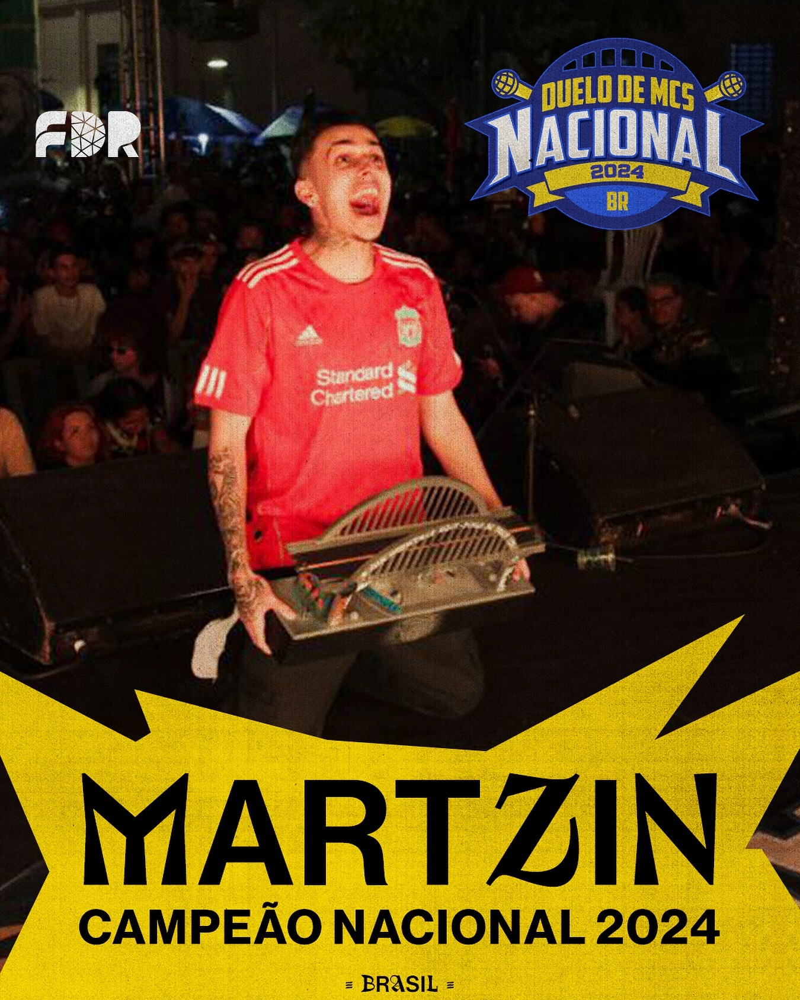
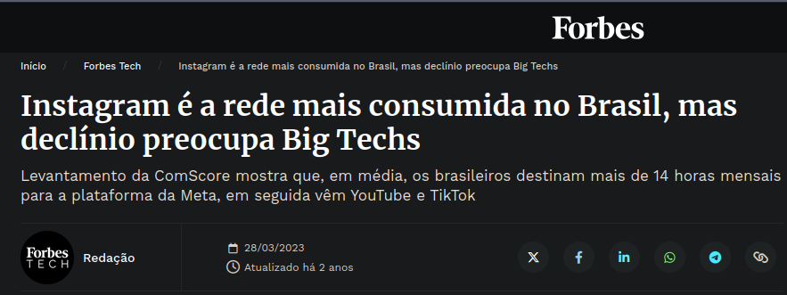
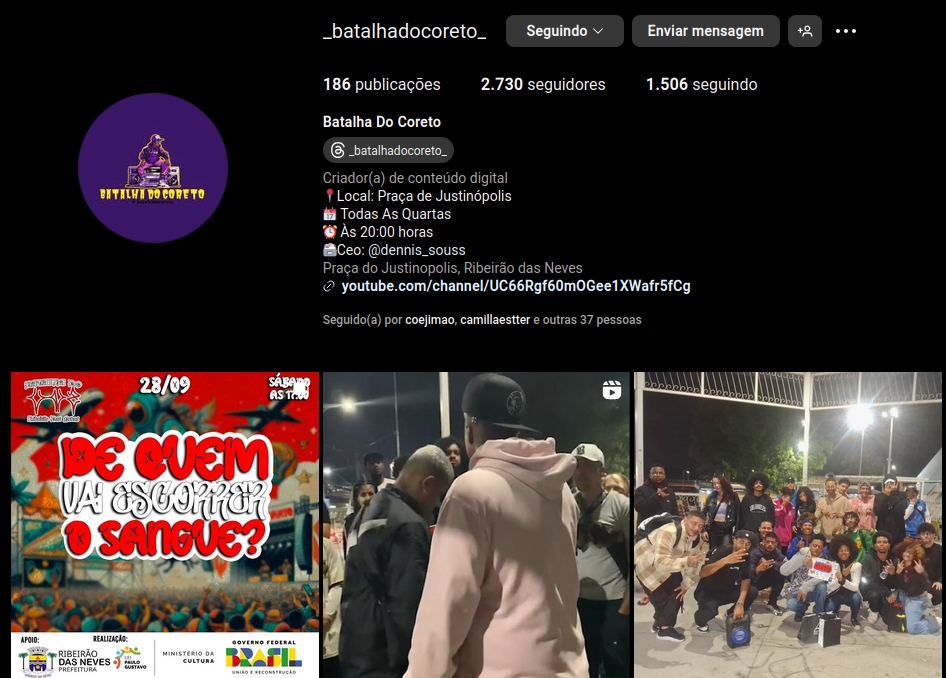
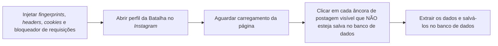
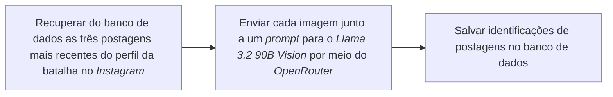
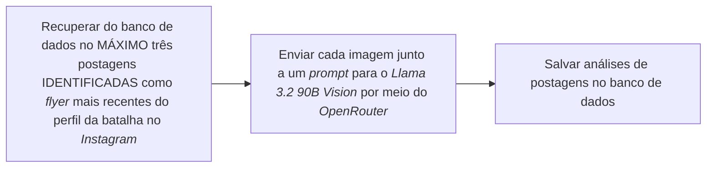
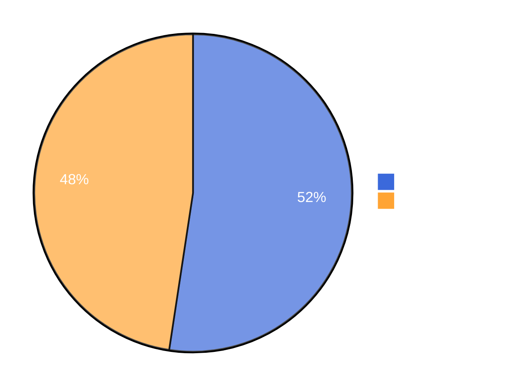
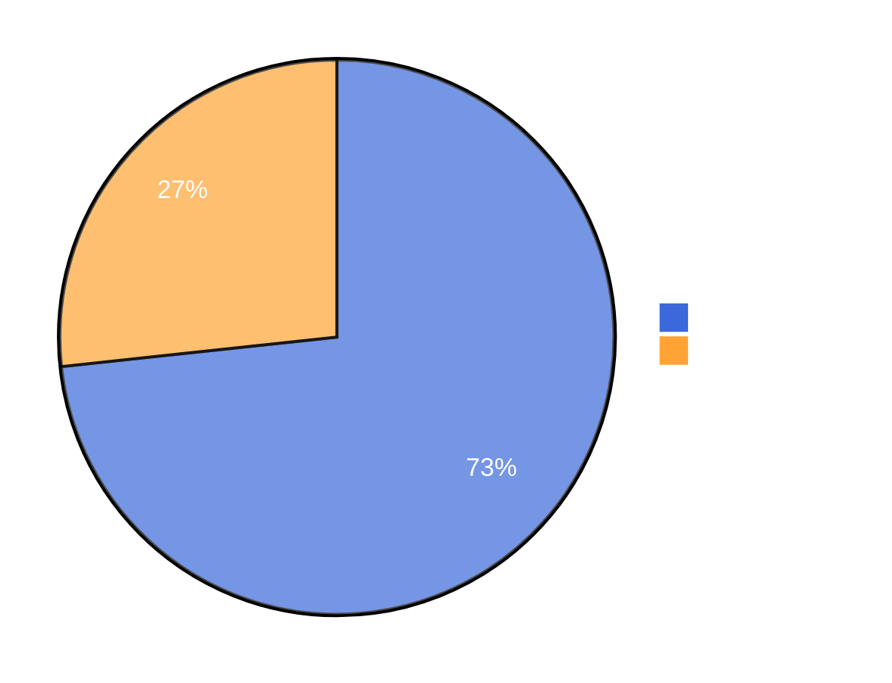

# Extração de Texto de Panfletos Digitais em Mídias Sociais Utilizando Modelo Multimodal

### Autor: Eric Stefano dos Santos Lima

### Orientador: Felipe Augusto Lima Reis

<p>Pontíficia Universidade Católica de Minas Gerais - Belo Horizonte - 2024</p>

<!-- Boa tarde a todos, eu me chamo Eric, o meu orientador é o professor Felipe Reis, e o título do meu trabalho é Extração de Texto de Panfletos Digitais em Mídias Sociais Utilizando Modelo Multimodal. -->

---

# Introdução

## Contexto - Cultura Urbana

<div class="grid grid-cols-2 justify-start">

- Hip Hop.
  - Rap / MCs.
  - DJs.
  - Breakdance.
  - Grafite.

<div class="flex flex-col items-center justify-center">

<Author class="mt-2">Fonte: @duelonacional e @familia_de_rua via <em>Instagram</em>.</Author>
</div>
</div>

<!-- Para contextualizar meu trabalho eu preciso falar sobre a cultura urbana, em particular o Hip-Hop, um movimento periférico que surgiu na década de setenta no Bronx, em Nova York lá nos Estados Unidos e era composto majoritariamente por negros e latinos.

Ele é dividido em quatro grandes expressões artísticas:

O Rap, que é sigla para "ritmo e poesia" e é um estilo musical composto por letras rimadas, criadas por MCs, e cantadas sobre ritmos de batidas.

Os DJs, que compõem ou remixam as músicas.

O Breakdance, que é a dança característica voltada pro ritmo.

E o grafite, que expressa a realidade periférica através da pintura. -->

---

# Introdução

## Contexto - Cultura Urbana

<div class="grid grid-cols-2">

- Chegada no Brasil.
- Batalhas de Rima:
  - Rodadas em turnos.
  - Votação pela platéia e jurados.
  - Critérios de voto são flexíveis.
  - Vence quem é o mais votado em três rodadas.
- Duelo Nacional de MCs:
  - Viaduto Santa Tereza - Belo Horizonte.

<div class="flex flex-col justify-start items-center">

<Author class="mt-2">Fonte: @duelonacional e @familia_de_rua via <em>Instagram</em>.</Author>
</div>
</div>

<!-- Essa cultura chegou ao Brasil trazendo consigo as batalhas de rima. Essas batalhas funcionam de forma semelhante a uma debate argumentativo cronometrado, onde um MC apresenta um argumento direcionado ao seu adversário, que, por sua vez, responde com uma réplica.

Após as rodadas, uma votação é realizada pela plateia e pelo júri, e os critérios avaliados podem variar, como a melhor rima, o argumento mais impactante, presença de palco ou simplesmente entretenimento. Vence a partida o MC mais votado pela plateia e pelo júri.

O Duelo de MCs Nacional é um evento deste tipo e ele acontece anualmente desde 2007, onde 27 MCs de todos os estados mais o Distrito Federal disputam pelo título de campeão nacional no Viaduto Santa Tereza, aqui em BH. Para competir, é preciso estar no ranking das batalhas da região e vencer o estadual. -->

---

# Introdução

## Contexto - Informação e Mídias Sociais

- O crescente uso de mídias sociais para disseminação de informações.
- O uso de mídias sociais para busca de informações em detrimento de meios tradicionais.

<div class="flex flex-col">

<Author class="mt-2">Fonte: Forbes - <a href="https://forbes.com.br/forbes-tech/2023/05/geracao-z-adota-redes-sociais-como-principal-ferramenta-de-busca/">https://forbes.com.br/forbes-tech/2023/05/geracao-z-adota-redes-sociais-como-principal-ferramenta-de-busca/</a></Author>
</div>

<!-- Outro contexto importante é a popularização das mídias sociais na disseminação e obtenção de informações. Essa matéria do Forbes destaca que a Geração Z já adota redes sociais para busca em detrimento de meios tradicionais como o Google. -->

---

# Introdução

## Contexto - Instagram

<div class="flex flex-col ">

<Author class="mt-2">Fonte: Forbes -
<a href="https://forbes.com.br/forbes-tech/2023/03/instagram-segue-na-lideranca-no-brasil-mas-declinio-das-redes-preocupa-big-techs/">https://forbes.com.br/forbes-tech/2023/03/instagram-segue-na-lideranca-no-brasil-mas-declinio-das-redes-preocupa-big-techs/</a>
</Author>
</div>

<!--E essa outra matéria, também do Forbes, destaca que o Instagram é a rede social mais consumida no Brasil. -->

---

# Introdução

<div class="grid grid-cols-2 gap-4 min-h-full">
<div class="flex flex-col justify-center items-center">

<Author class="mt-3">Fonte: Próprio autor e <em>Alphabet</em> via <em>Google</em>.</Author>
</div>
<div class="flex flex-col justify-start items-center">

<Author class="-mt-8">Fonte: @_batalhadocoreto_ via <em>Instagram</em>.</Author>
</div>
</div>

<!-- Na imagem a esquerda, é possível ver uma pesquisa no Google por "batalha do côreto" em uma aba anônima, e o primeiro resultado é de uma página no Instagram.

Na imagem a direita já é possível ver o perfil dessa batalha que acontece em Justinópolis. -->

---

# Introdução

## Motivação

- O impacto das batalhas de rima e a cultura urbana.
- A importância da visibilidade e preservação dessas manifestações culturais.
- O interesse em analisar os dados presentes nas postagens relacionadas às batalhas de rima.

## Justificativa

- A exclusividade dos dados encontrados em mídias sociais.
- A dificuldade de extrair dados presentes em formatos não estruturados.

<!-- Com isso, a motivação do meu trabalho é o impacto das batalhas de rima e a cultura urbana, a importância da visibilidade e preservação dessas manifestações culturais e o interesse em analisar os dados presentes nas postagens relacionadas às batalhas de rima.

O trabalho se justifica devido exclusividade desses dados, que só podem ser encontrados em mídias sociais, e também na natureza desses dados, que, em sua maioria, estão presentes em formatos NÃO ESTRUTURADOS.
 -->

---

# Referencial Teórico

- Dados não estruturados
- Extração de Dados
- <em>Large Language Model (LLM)</em>
- <em>Engenharia de Prompt</em>
- Visão Computacional

<!-- Gandomi e Haider descrevem dados não estruturados como informações que não seguem um formato rígido ou padrão, como imagens, áudio e vídeo, e que carecem da organização necessária para análise automatizada por sistemas tradicionais.

Han e outros descrevem a extração de dados como o processo de descobrir padrões e outros tipos de conhecimento em grandes conjuntos de dados, sendo essencial para transformar os dados em conhecimento útil e organizado.

Chan e outros descrevem os LLMs como modelos computacionais capazes de prever a probabilidade de sequência de palavras ou gerar um novo texto com base em uma determinada entrada.

Dentro das LLMs, White e outros descrevem a engenharia de prompt como à pratica de criar e ajustar instruções para interagir com modelos de linguagem, guiando o modelo para as saídas desejadas.

E Gonzalez e Woods descrevem a visão computacional como a área da computação que busca emular a visão humana, abrangendo o aprendizado, a capacidade de fazer inferências e realizar ações com base em entradas visuais.

 -->

---

# Trabalhos Relacionados

- Advancements in Multimodal Social Media Post Summarization: Integrating GPT-4 for Enhanced Understanding, Alam et al. (2024)
- Image to Text Recognition for Detecting Human and Machine Altered News in Social Media, Kamal et al. (2023)

<!--
Alguns trabalhos relacionados:

Alam e outros utilizaram uma metodologia que integra múltiplas modalidades de dados, onde são aplicadas técnicas de processamento de linguagem natural e de visão computacional por meio de vários modelos para o processamento de conteúdo extraído de mídias sociais.

Kamal e outros propuseram uma metodologia que utiliza OCR por meio da API da Google Cloud Vision, e consiste em extrair texto de imagens e notícias e depois verificar a sua autentiticidade comparando-as com um banco de dados confiável.  -->

---

# Objetivos

## Objetivo Geral

- Desenvolver um sistema para extração, gerenciamento e visualização de informações sobre batalhas de rima a partir de imagens de panfletos digitais no <em>Instagram</em>.

## Objetivos Específicos

- Cadastro e gerenciamento de batalhas de rima.
- Visualização de informações sobre batalhas de rima;
- <em>Web scraping</em> de postagens do <em>Instagram</em>.
- Identificação e extração de informações com <em>Multimodal Large Language Model</em> (MLLM).

<!-- Com isso, o Objetivo Geral do meu trabalho é desenvolver um sistema para extração, gerenciamento e visualização de informações sobre batalhas de rima a partir de imagens de panfletos digitais no Instagram.

Os objetivos Específicos são:
- O cadastro e Gerenciamento de batalhas de rima.
- A visualização de informações sobre batalhas de rima;
- Web Scraping de postagens no Instagram.
- A Identificação e extração de informações com um modelo multimodal.
 -->

---

# Metodologia

## Arquitetura do Sistema

- Monolito <em>full-stack</em> com três módulos:
  - Módulo de Extração de Postagens.
  - Módulo de Análise de Postagens.
  - Módulo de Exibição.

## Tecnologias Utilizadas

- <em>Node.js</em> e <em>TypeScript</em>.
- <em>Playwright</em> e <em>Crawlee</em>.
- <em>OpenRouter</em> e <em>Llama 3.2 90B Vision</em>.
- <em>Vue.js</em> e <em>Nuxt.js</em>.
- <em>MapLibre</em>, <em>Maptiler</em> e <em>OpenStreetMap</em>.

<!-- A arquitetura do sistema é composta por um monolito full-stack com três módulos:
- Extração de Postagens
- Análise de Postagens

e

- Exibição

As tecnologias utilizadas são as seguintes:

Eu destaco o Playwright que é uma ferramenta pra testes automatizados que utiliza navegadores reais, na qual o Crawlee usa de base para a montagem de crawlers ou scrapers, que extraem informações da web.

Também destaco o OpenRouter que é um serviço que disponbiliza diversos modelos através de uma API única com um sistema de crédito.
 -->

---

# Metodologia

<h2 class="mb-4">Arquitetura</h2>

<div class="flex flex-col">
  
  <Author class="mt-3">Fonte: Próprio autor.</Author>
</div>

<!-- Aqui é possível ter uma visão geral do sistema e alguns fluxos de trabalho. -->

---

# Metodologia

## Considerações sobre <em>Web Scraping</em>

- Página dinâmica com <em>JavaScript:</em>
  - Utilização de um navegador real.
- <em>Anti-Bot / Anti-Scraping:</em>
  - Injeção de <em>cookies</em>, <em>browser fingerprints</em> e <em>headers</em>.
- Custo de rede:
  - Bloqueamento de requisições de recursos estáticos.
- Manutenção e Robustez:
  - Utilização de seletores <em>CSS</em> de <em> tags HTML</em>.

<!-- Algumas considerações sobre web scraping:

O Instagram usa JavaScript para montagem dinâmica das páginas, além de apresentar sistemas anti-bot e anti-scraping.
A utilização de um navegador real nesse sentido foi útil porque garante que as páginas vão carregar normalmente, além de permitir a manipulação de metadados do navegador, fazendo com que o comportamento seja mais semelhante a de um usuário real.

Para evitar desperdício de rede, recursos estáticos como imagens, vídeos, e fontes são bloqueados.

Para ser mais confiável e robusto, foram utilizados seletores CSS com base na estrutura das tags HTML da página.
 -->

---

# Metodologia

<h2 class="mb-4">Extração de Postagens</h2>



<v-click>
```ts {|2,3|8,9|11,12|13,14,15}
const LOCATORS = {
  IMAGE_POST_ANCHOR: 'a[href*="/p/"]',
  IMAGE: 'img',
  TIMESTAMP: 'span time',
}
// ...

const postElements = await page.locator(LOCATORS.IMAGE_POST_ANCHOR).all() // Selecionar todas as âncoras de postagem.
for await (const element of postElements) { // Para todas as âncoras de postagem.
// ...
await element.click() // Clicar na postagem.
const img = element.locator(LOCATORS.IMAGE) // Selecionar o elemento de imagem.
const src = await img.getAttribute('src') // Extrair a URL.
// ... Salvar outros dados da postagem e baixar a imagem.
} // Fonte: Próprio autor

```
</v-click>

<!-- Aqui estão os passos feitos pelo coletor de postagens no processo de extração.

Ele injeta e modifica alguns metadados, destaque pra injeção de cookies que permite pular o fluxo de login do Instagram.
Após isso, ele abre o perfil da batalha no Instagram, aguarda o carregamento da página, e clica em cada âncora de postagem visível que não esteja salva no banco de dados. Após isso, ele extrai os dados e os salva.

Aqui tem um trecho de código demonstrando o processo e o salvamento das imagens das postagens.

- Aqui estão os seletores que eu mencionei anteriormente, diferente de um seletor por classe CSS, eles tendem a mudar menos.
Este primeiro seleciona todas os elementos de âncora que tenham o trecho /p/ em seu atributo href.

- Aqui a busca pela imagem da postagem.

- E por fim o salvamento desses dados.

 -->

---

# Metodologia

## Considerações sobre Postagens

<div class="grid grid-cols-2">

- Pode não ser um <em>flyer</em>.
- Pode conter fontes incomuns e mais de um tipo de fonte.
- Posicionamento aleatório de elementos.
- Excesso de informações.
- Foco do trabalho na data, hora e localização.

<div class="flex flex-col justify-start items-center">

<Author class="mt-2">Fonte: @bp7_bh via <em>Instagram</em>.</Author>
</div>
</div>

<!-- Algumas considerações sobre essas postagens:
- Elas podem não ser um flyer, podem por exemplo ser uma imagem do local, ou de MCs duelando.
- Podem conter fontes incomuns e mais de um tipo de fonte.
- Tem um posicionamento aleatório de elementos.
- E podem conter um excesso de informações que não são foco do trabalho, que visa extrair a data, hora e localização apenas.
 -->

---

# Metodologia

<h2 class="mb-4">Análise de Postagens - Identificação</h2>



<v-click>
<div class="grid grid-cols-2 gap-4">
```ts
{ // System Prompt - Identificação
  role: 'system' as const,
  content: `
You are a flyer image identification tool.
 - ONLY RESPOND true OR false
 - ONLY RESPOND WITH ONE WORD TOKEN
 - Return true only if highly confident the image is a flyer
 - Return false if image does not meet flyer criteria
`
}
                // Fonte: Próprio autor
```

```ts
[{ // User Prompt - Solicitação
  type: 'text',
  text: 'Is the next image a flyer? Answer true or false.',
}, { // User Prompt - Imagem
  type: 'image_url',
  image_url: {
    url: base64image
  }
}]
// Fonte: Próprio autor
```

</div>
</v-click>

<!--
Aqui estão os passos realizados para a identificação dessas postagens:

Se inicia com a recuperação do banco de dados de três potagens mais recentes do perfil da batalha no Instagram, em seguida envia cada imagem junto a um prompt para o Llama 3.2 por meio do OpenRouter e por fim salva essas identificações no banco de dados.

- Aqui estão os dois prompts criados, o prompt de sistema, definindo para o modelo que ele deve agir como uma ferramenta de identificação de flyers e responder somente uma palavra: verdadeiro ou falso.

- E o prompt de solicitação que envia a imagem e uma pergunta, a pergunta sendo se a imagem se trata de um flyer ou não. -->

---

# Metodologia

<h2 class="mb-4">Análise de Postagens - Extração</h2>



<!--
Aqui estão os passos realizados para a extração de informações dessas postagens:

Se inicia com a recuperação do banco de dados de no MÁXIMO três potagens  IDENTIFICADAS previamente como flyer mais recentes do perfil da batalha no Instagram, em seguida envia cada imagem junto a um prompt para o Llama 3.2 e por fim salva essas análises no banco de dados. -->

---

# Metodologia

<h2 class="mb-4">Análise de Postagens - Extração</h2>

<div class="grid">

```ts
{ // System Prompt - Extração
  role: 'system' as const,
  content: `
You are a flyer image analysis tool that extracts and structures temporal and spatial information.
- ANSWER in pt-br (brazilian portuguese)
- ONLY RESPOND THE CSV LINE
- ALWAYS validate dates:
  * ONLY accept dates between current date and next 12 months
  * If date is in the past or more than 12 months in future, return null
- ONLY extract location if you are highly confident it's an event venue
- If either date OR location is invalid/uncertain, return null for BOTH
- ALWAYS ANSWER ONLY WITH A SINGLE LINE IN CSV FORMAT
- ALWAYS USE ; AS THE SEPARATOR FOR THE CSV LINE

Required format: YYYY-MM-DDTHH:mm;location

Valid response examples:
null;null
2024-03-15T14:30;Parque Central
`
} // Fonte: Próprio autor

```

</div>

<!-- Aqui está o prompt de sistema definido, instruindo ao modelo o seu papel de ferramenta de extração de informações temporais e espaciais, algumas regras a se considerar, o formato esperado, além de exemplos de resposta. -->

---

# Metodologia

<h2 class="mb-4">Análise de Postagens - Extração</h2>

<div class="grid">

```ts
[{ // User Prompt - Solicitação
  type: 'text',
  text: `
    The current year is ${new Date().getFullYear()}.
    The image content will be in brazilian format.
    It was posted on ${format(post.timestamp, 'yyyy-MM-dd')}
    Extract the datetime and location information from the next image.`,
  },

  { // User Prompt - Imagem
    type: 'image_url',
    image_url: {
      url: base64image,
}]                                              // Fonte: Próprio autor

```
</div>

<!-- Aqui está o prompt de solicitação pedindo ao modelo que extraia a data, hora e localização da imagem, além de fornecer informações extras como ano atual e data de criação da postagem. -->

---

# Resultados

## Análise Qualitativa - Geral

- Cadastro de 5 batalhas de rima.
- Extração de um total de 103 postagens através do próprio sistema.
- Avaliação manual das postagens.

<!-- Bom, epartindo para os resultados, foi feito uma análise qualitativa analisando manualmente 103 postagens de 5 batalhas coletadas atráves do próprio sistema.-->

---

# Resultados

## Análise Qualitativa - Identificação

- Identificações manuais comparadas com as identificações feitas pelo <em>Multimodal Large Language Model</em> (MLLM).
- Critério:
  - A resposta do modelo identifica corretamente a postagem como <em>flyer</em>.

<!-- Para as identificações, ela foi marcada como correta se o modelo respondeu verdadeiro para uma imagem que realmente era um flyer. -->

---

# Resultados

## Análise Qualitativa - Extração

- Foram utilizadas somente as postagens identificadas como <em>flyer</em> na etapa anterior que continham data, hora e localização.
- Análises manuais comparadas com as extrações feitas pelo <em>MLLM</em>.

- Critérios:

  - A resposta do modelo está no formato <em>Comma Separated Values</em> (CSV) correto (<em>YYYY-MM-DDTHH:mm;location</em>), com
    apenas um separador “ponto-e-vírgula”;
  - A resposta do modelo contém data, hora e localização;
  - A localização da resposta é um nome próprio que identifica exclusivamente uma localização geográfica, como o nome de uma cidade, bairro, viaduto, rua ou outro lugar específico;
  - A data e a hora são as mesmas escritas na postagem.
  - A localização é a mesma ou equivalente a que está escrita na postagem, como, por exemplo, um endereço.

  <!-- A análise da extração de informações já foi mais criteriosa. Foram utilizadas somente as postagens identificadas como flyer na etapa anterior que continham data hora e localização. Os critério para a extração ser considerada correta foram:

  - A resposta do modelo está no formato <em>Comma Separated Values</em> (CSV) correto (<em>YYYY-MM-DDTHH:mm;location</em>), com
  apenas um separador “ponto-e-vírgula”;

  - A resposta do modelo contém data, hora e localização;

  - A localização da resposta é um nome próprio que identifica exclusivamente uma localização geográfica, como o nome de uma cidade, bairro, viaduto, rua ou outro lugar específico;

  - A data e a hora são as mesmas escritas na postagem.

  - A localização é a mesma ou equivalente a que está escrita na postagem, como, por exemplo, um endereço.
   -->

---

# Resultados

## Análise Qualitativa

De 103 postagens, 54 postagens foram identificadas corretamente como <em>flyer</em>. Delas, foram mantidas 45 postagens que continham data hora e localização e 33 dessas postagens foram analisadas corretamente.

<div class="grid grid-cols-2 gap-8">
  <div>
    <h4 class="text-center -mt-1.5">Identificação de <em>Flyers</em></h4>

<Author class="-mt-8">Fonte: Próprio autor.</Author>
</div>

  <div>
    <h4 class="text-center -mt-1.5">Extração de Informações</h4>


<Author class="-mt-8">Fonte: Próprio autor.</Author>

</div>
</div>

<!-- Total geral aproximadamente 32 % (identificadas e analisadas corretamente) -->

---
layout: iframe
url: http://localhost:3000

---

# Conclusão

- Sistema implementado atingiu os objetivos propostos.
- Integração bem-sucedida de diferentes tecnologias.
- Sistema apresenta 52,4% de taxa de acerto na identificação de <em>flyers</em>, indicando possível aleatoriedade.
- Sistema apresenta 73,3% de taxa de acerto na extração de datas e locais de <em>flyers</em>.

---

# Trabalhos Futuros

- Otimização de parâmetros do <em>MLLM</em>.
- <em>Prompts</em> mais específicos (flyers de hip-hop, flyers musicais).
- Integração de outros <em>MLLMs</em>.
- Teste de soluções alternativas como <em>OCR</em>.
- Suporte para múltiplas .
- Suporte para outros tipos de eventos.

---

# Referências

<Reference>IJAZ, Daiyaan; NISSAN, Fady; et al. The Impact of Social Media on HCI. 2021 International Conference on Computational Science and Computational Intelligence (CSCI), 2021, p. 4-5. DOI: 10.1109/CSCI54926.2021.00284.</Reference>

<Reference>NADEEM, Muhammad Shahroz; FRANQUEIRA, Virginia N. L.; et al. A Survey of Deep Learning Solutions for Multimedia Visual Content Analysis. IEEE Access, v. 7, p. 84003-84019, 2019. DOI: 10.1109/ACCESS.2019.2924733.</Reference>

<Reference>NARAYANAN, Arvind. Understanding Social Media Recommendation Algorithms. 2023. Disponível em: https://knightcolumbia.org. Acesso em: 31 ago. 2024.</Reference>

<Reference>GANDOMI, Amir; HAIDER, Murtaza. Beyond the hype: Big data concepts, methods, and analytics. International Journal of Information Management, v. 35, p. 137-144, abr. 2015. DOI: 10.1016/j.ijinfomgt.2014.10.007.</Reference>

<Reference>SANTOS, Sávio Oliveira da Silva. Batalhas de rima: espaços de reeducação de jovens homens negros. Revista África e Africanidades, v. XVI, n. 46, p. 7-21, maio 2023. Disponível em: https://africaeafricanidades.com.br. Acesso em: 1 set. 2024.</Reference>

<Reference>MELTWATER. Digital 2024 Global World Overview Report. 2024, p. 10. Disponível em: https://indd.adobe.com. Acesso em: 1 set. 2024.</Reference>

<Reference>TILIA, Caroline de. Como o TikTok virou o novo Google para a Geração Z. Forbes Brasil, 2024. Disponível em: https://forbes.com.br. Acesso em: 1 set. 2024.</Reference>

---

# Referências

<Reference>GONZALEZ, R. C.; WOODS, R. E. Digital Image Processing, Global Edition. Pearson Education, 2018. ISBN: 9781292223070. Disponível em: https://books.google.com.br.</Reference>

<Reference>HAN, J.; PEI, J.; TONG, H. Data Mining: Concepts and Techniques. 4. ed. Morgan Kaufmann, 2022. ISBN: 9780128117613. Disponível em: https://books.google.com.br.</Reference>

<Reference>CHANG, Yupeng; et al. A Survey on Evaluation of Large Language Models. ACM Transactions on Intelligent Systems and Technology, v. 15, n. 3, art. 39, jun. 2024. DOI: 10.1145/3641289.</Reference>

<Reference>WHITE, Jules; et al. A Prompt Pattern Catalog to Enhance Prompt Engineering with ChatGPT. 2023. Disponível em: https://arxiv.org. DOI: 10.48550/arXiv.2302.11382.</Reference>

---

# Referências

<Reference>KAMAL, Abdullah; et al. Image to Text Recognition for Detecting Human and Machine Altered News in Social Media. 2023 10th International Conference on Internet of Things: Systems, Management and Security (IOTSMS), 2023, p. 72-74. DOI: 10.1109/IOTSMS59855.2023.10325722.</Reference>

<Reference>ALAM, Md Jahangir; et al. Advancements in Multimodal Social Media Post Summarization: Integrating GPT-4 for Enhanced Understanding. 2024 IEEE 48th Annual Computers, Software, and Applications Conference (COMPSAC), 2024, p. 1934-1940. DOI: 10.1109/COMPSAC61105.2024.00307.</Reference>

<Reference>GAZEAU, Valentin; et al. Enhancing Social Media Data Collection for Digital Forensic Investigations: A Web Parser Approach. 2024 International Conference on Computer, Information and Telecommunication Systems (CITS), 2024, p. 1-7. DOI: 10.1109/CITS61189.2024.10607983.</Reference>

<Reference>MINUŢ, Mihai-Dimitrie; et al. Social Media Post Impact Prediction using Computer Vision and Natural Language Processing. 2022 International Conference on Innovations in Intelligent Systems and Applications (INISTA), 2022, p. 1-6. DOI: 10.1109/INISTA55318.2022.9894256.</Reference>

---

<div class="min-h-full min-w-full flex flex-col items-center justify-center space-y-2">
 <h1><span class="text-#078930">Obrigado </span> <span class="text-#fcdd09">pela</span> <span class="text-#da121a">Atenção!</span></h1>
 <h5>E-mail: <a href="mailto:eric.lima.1330475@sga.pucminas.br">eric.lima.1330475@sga.pucminas.br</a></h5>
 <h5>Código Fonte: <a href="https://github.com/ericstefano/mapadabatalha">github.com/ericstefano/mapadabatalha</a></h5>
</div>
