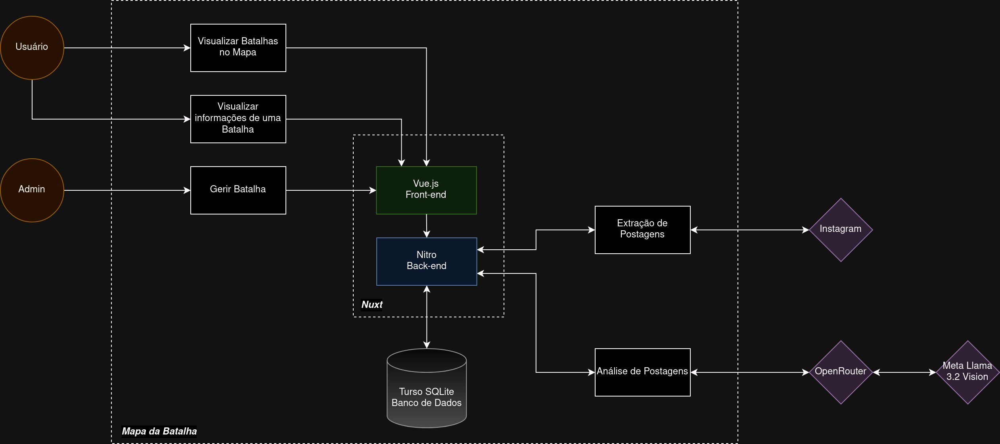

# Extração de Texto de Panfletos Digitais em Mídias Sociais Utilizando Modelo Multimodal

### Autor: Eric Stefano dos Santos Lima

### Orientador: Felipe Augusto Lima Reis

<p>Pontíficia Universidade Católica de Minas Gerais - Belo Horizonte - 2024</p>

<!-- Boa tarde a todos, eu me chamo Eric, o meu orientador é o professor Felipe Reis, e o título do meu trabalho é Extração de Texto de Panfletos Digitais em Mídias Sociais Utilizando Modelo Multimodal. -->

---

# Introdução

## Contexto - Cultura Urbana

<div class="grid grid-cols-2 justify-start">

- Hip Hop.
  - Rap / MCs.
  - DJs.
  - Breakdance.
  - Grafite.

<div class="flex flex-col items-center justify-center">

<Author class="mt-2">Fonte: @duelonacional e @familia_de_rua via <em>Instagram</em>.</Author>
</div>
</div>

<!-- Para contextualizar meu trabalho, é necessário abordar a cultura urbana, em particular o Hip-Hop, movimento periférico que surgiu na década de setenta no Bronx, em Nova York nos Estados Unidos, composto majoritariamente por negros e latinos.

Ele é dividido em quatro grandes expressões artísticas:

O Rap, sigla para "ritmo e poesia", um estilo musical com letras rimadas criadas pelos mestres de cerimônia, que são cantadas sobre um ritmo de batidas.

Os DJs, que compõem ou remixam as músicas.

O Breakdance, que é a dança característica voltada pra esse ritmo.

E o grafite, que expressa a realidade periférica através da pintura. -->

---

# Introdução

## Contexto - Cultura Urbana

<div class="grid grid-cols-2">

- Chegada no Brasil.
- Batalhas de Rima:
  - Rodadas em turnos.
  - Votação pela platéia e jurados.
  - Critérios de voto são flexíveis.
  - Vence quem é o mais votado em três rodadas.
- Duelo Nacional de MCs:
  - Viaduto Santa Tereza - Belo Horizonte.

<div class="flex flex-col justify-start items-center">

<Author class="mt-2">Fonte: @duelonacional e @familia_de_rua via <em>Instagram</em>.</Author>
</div>
</div>

<!-- Essa cultura chegou ao Brasil trazendo consigo as batalhas de rima. Essas batalhas funcionam de forma semelhante a uma debate argumentativo cronometrado, onde um MC apresenta um argumento direcionado ao seu rival, que, por sua vez, responde com uma réplica.

Após as rodadas, uma votação é realizada pela plateia e pelo júri, e os critérios avaliados podem variar, como a melhor rima, o argumento mais impactante, presença de palco ou simplesmente entretenimento. Vence a partida o MC mais votado pela plateia e pelo júri.

O Duelo de MCs Nacional é um evento deste tipo e ele acontece anualmente desde 2007, onde 27 MCs de todos os estados mais o Distrito Federal disputam pelo título de campeão nacional no Viaduto Santa Tereza, aqui em BH. Para competir, é preciso estar no ranking das batalhas da região e vencer o estadual. -->

---

# Introdução

## Contexto - Informação e Mídias Sociais

-	O crescente uso de mídias sociais para disseminação de informações.
- O uso de mídias sociais para busca de informações em detrimento de meios tradicionais.


<div class="flex flex-col">

<Author class="mt-2">Fonte: Forbes - <a href="https://forbes.com.br/forbes-tech/2023/05/geracao-z-adota-redes-sociais-como-principal-ferramenta-de-busca/">https://forbes.com.br/forbes-tech/2023/05/geracao-z-adota-redes-sociais-como-principal-ferramenta-de-busca/</a></Author>
</div>

<!-- Outro contexto importante é a popularização das mídias sociais na disseminação e obtenção de informações. Essa matéria do Forbes destaca que a Geração Z já adota redes sociais para busca de informações ao invés de meios tradicionais como o Google. -->

---

# Introdução

## Contexto - Instagram

<div class="flex flex-col ">

<Author class="mt-2">Fonte: Forbes - 
<a href="https://forbes.com.br/forbes-tech/2023/03/instagram-segue-na-lideranca-no-brasil-mas-declinio-das-redes-preocupa-big-techs/">https://forbes.com.br/forbes-tech/2023/03/instagram-segue-na-lideranca-no-brasil-mas-declinio-das-redes-preocupa-big-techs/</a>
</Author>
</div>

<!--E essa outra matéria, também do Forbes, destaca que o Instagram é a rede social mais consumida no Brasil. -->

---

# Introdução

<div class="grid grid-cols-2 gap-4 min-h-full">
<div class="flex flex-col justify-center items-center">

<Author class="mt-3">Fonte: Próprio autor e <em>Alphabet</em> via <em>Google</em>.</Author>
</div>
<div class="flex flex-col justify-start items-center">

<Author class="-mt-8">Fonte: @_batalhadocoreto_ via <em>Instagram</em>.</Author>
</div>
</div>

<!-- Na imagem a esquerda, é possível ver uma pesquisa no Google por "batalha do côreto" em uma aba anônima, e o primeiro resultado é de uma página no Instagram.

Na imagem a direita já é possível ver o perfil dessa batalha que acontece em Justinópolis. -->

---

# Introdução

## Motivação

- O impacto das batalhas de rima e a cultura urbana.
- A importância da visibilidade e preservação dessas manifestações culturais.
- O interesse em analisar os dados presentes nas postagens relacionadas às batalhas de rima.

## Justificativa
- A exclusividade dos dados encontrados em mídias sociais.
- A dificuldade de extrair dados presentes em formatos não estruturados.

<!-- Com isso, a motivação do meu trabalho é o impacto das batalhas de rima e a cultura urbana, a importância da visibilidade e preservação dessas manifestações culturais e o interesse em analisar os dados presentes nas postagens relacionadas às batalhas de rima.

O trabalho se justifica devido exclusividade desses dados, que só podem ser encontrados em mídias sociais, e na natureza desses dados, que, em sua maioria, estão presentes no formato de vídeos e imagens, se tratando então de DADOS NÃO ESTRUTURADOS.
 -->

---

# Revisão Bibliográfica

---

# Trabalhos Relacionados
---

# Objetivos

## Objetivo Geral

<!-- - Desenvolver um sistema para extração, gerenciamento e visualização de informações sobre batalhas de rima no <em>Instagram</em>. -->
- Desenvolver um sistema para extração, gerenciamento e visualização de informações sobre batalhas de rima a partir de imagens de panfletos digitais no <em>Instagram</em>.


## Objetivos Específicos

- Cadastro e gerenciamento de batalhas de rima.
- Visualização de informações sobre batalhas de rima;
- <em>Web scraping</em> de postagens do <em>Instagram</em>.
- Identificação e extração de informações com <em>Multimodal Large Language Model</em> (MLLM).

---

# Metodologia

## Arquitetura do Sistema

- Monolito <em>full-stack</em> com três módulos principais:
  - Módulo de Extração de Postagens.
  - Módulo de Análise de Postagens.
  - Módulo de Exibição.

## Tecnologias Utilizadas

- <em>Node.js</em> e <em>TypeScript</em>.
- <em>Crawlee</em> e <em>Playwright</em>.
- <em>OpenRouter</em> e <em>Llama 3.2 90B Vision</em>.
- <em>Vue.js</em> e <em>Nuxt.js</em>.
- <em>MapLibre</em>, <em>Maptiler</em> e <em>OpenStreetMap</em>.


---

# Metodologia

<h2 class="mb-4">Arquitetura</h2>

<div class="flex flex-col">
  
  <Author class="mt-3">Fonte: Próprio autor.</Author>
</div>

---

# Metodologia

## Considerações sobre <em>Web Scraping</em>

- Página dinâmica com <em>JavaScript:</em>
  - Utilização de um navegador real.
- <em>Anti-Bot / Anti-Scraping:</em>
  - Injeção de <em>cookies</em>, <em>browser fingerprints</em> e <em>headers</em>.
- Custo de rede:
  - Bloqueamento de requisições de recursos estáticos.
- Manutenção e Robustez:
  - Utilização de seletores <em>CSS</em> de <em> tags HTML</em>.

---

# Metodologia

<h2 class="mb-4">Extração de Postagens</h2>


<v-click>
```ts {|2,3|8,9|11,12|13,14,15}
const LOCATORS = {
  IMAGE_POST_ANCHOR: 'a[href*="/p/"]',
  IMAGE: 'img',
  TIMESTAMP: 'span time',
}
// ...

const postElements = await page.locator(LOCATORS.IMAGE_POST_ANCHOR).all() // Selecionar todas as âncoras de postagem.
for await (const element of postElements) { // Para todas as âncoras de postagem.
  // ...
  await element.click() // Clicar na postagem.
  const img = element.locator(LOCATORS.IMAGE) // Selecionar o elemento de imagem.
  const src = await img.getAttribute('src') // Extrair a URL.
  // ... Salvar outros dados da postagem e baixar a imagem.
}                                               // Fonte: Próprio autor
```
</v-click>

---

# Metodologia

## Considerações sobre Postagens

<div class="grid grid-cols-2"> 

- Pode não ser um <em>flyer</em>.
- Pode conter fontes incomuns.
- Posicionamento aleatório de elementos.
- Muito texto ou informações irrelevantes.

<div class="flex flex-col justify-start items-center">

<Author class="mt-2">Fonte: @bp7_bh via <em>Instagram</em>.</Author>
</div>

</div>

---

# Metodologia

<h2 class="mb-4">Análise de Postagens - Identificação</h2>


<v-click>
<div class="grid grid-cols-2 gap-4">
```ts
{ // System Prompt - Identificação
  role: 'system' as const,
  content: `
You are a flyer image identification tool.
 - ONLY RESPOND true OR false
 - ONLY RESPOND WITH ONE WORD TOKEN
 - Return true only if highly confident the image is a flyer
 - Return false if image does not meet flyer criteria
`
}
                // Fonte: Próprio autor
```

```ts
[{ // User Prompt - Solicitação
  type: 'text',
  text: 'Is the next image a flyer? Answer true or false.',
},

{ // User Prompt - Imagem
  type: 'image_url',
  image_url: {
    url: base64image
  }
}]
                // Fonte: Próprio autor
```
</div>
</v-click>

---

# Metodologia

<h2 class="mb-4">Análise de Postagens - Extração</h2>


---

# Metodologia

<h2 class="mb-4">Análise de Postagens - Extração</h2>

<div class="grid">
```ts
{ // System Prompt - Extração
  role: 'system' as const,
  content: `
You are a flyer image analysis tool that extracts and structures temporal and spatial information.
- ANSWER in pt-br (brazilian portuguese)
- ONLY RESPOND THE CSV LINE
- ALWAYS validate dates:
  * ONLY accept dates between current date and next 12 months
  * If date is in the past or more than 12 months in future, return null
- ONLY extract location if you are highly confident it's an event venue
- If either date OR location is invalid/uncertain, return null for BOTH
- ALWAYS ANSWER ONLY WITH A SINGLE LINE IN CSV FORMAT
- ALWAYS USE ; AS THE SEPARATOR FOR THE CSV LINE

Required format: YYYY-MM-DDTHH:mm;location

Valid response examples:
null;null
2024-03-15T14:30;Parque Central 
`
}                                               // Fonte: Próprio autor

```
</div>

---

# Metodologia

<h2 class="mb-4">Análise de Postagens - Extração</h2>

<div class="grid">
```ts
[{ // User Prompt - Solicitação
  type: 'text',
  text: `
    The current year is ${new Date().getFullYear()}. 
    The image content will be in brazilian format.
    It was posted on ${format(post.timestamp, 'yyyy-MM-dd')}
    Extract the datetime and location information from the next image.`,
  },

  { // User Prompt - Imagem
    type: 'image_url',
    image_url: {
      url: base64image,
}]                                              // Fonte: Próprio autor


```
</div>

---

# Resultados

## Análise Qualitativa - Geral

- Cadastro de 5 batalhas de rima.
- Extração de um total de 103 postagens através do próprio sistema.
- Avaliação manual das postagens.

---

# Resultados

## Análise Qualitativa - Identificação
- Identificações manuais comparadas com as identificações feitas pelo <em>Multimodal Large Language Model</em> (MLLM).
- Critério:
  - A resposta do modelo identifica corretamente a postagem como <em>flyer</em>.
  

---

# Resultados

## Análise Qualitativa - Extração

- Foram utilizadas somente as postagens identificadas como <em>flyer</em> na etapa anterior que continham data, hora e localização.
- Análises manuais comparadas com as extrações feitas pelo <em>MLLM</em>.

- Critérios:
  - A resposta do modelo está no formato <em>Comma Separated Values</em> (CSV) correto (<em>YYYY-MM-DDTHH:mm;location</em>), com
  apenas um separador “ponto-e-vírgula”;
  - A resposta do modelo contém data, hora e localização;
  - A localização da resposta é um nome próprio que identifica exclusivamente uma localização geográfica, como o nome de uma cidade, bairro, viaduto, rua ou outro lugar específico;
  - A data e a hora são as mesmas escritas na postagem.
  - A localização é a mesma ou equivalente a que está escrita na postagem, como, por exemplo, um endereço.

---

# Resultados

## Análise Qualitativa

De 103 postagens, 54 postagens foram identificadas corretamente como <em>flyer</em>. Delas, foram mantidas 45 postagens que continham data hora e localização e 33 dessas postagens foram analisadas corretamente.

<div class="grid grid-cols-2 gap-8">
  <div>
    <h4 class="text-center -mt-1.5">Identificação de <em>Flyers</em></h4>

<Author class="-mt-8">Fonte: Próprio autor.</Author>
</div>


  <div>
    <h4 class="text-center -mt-1.5">Extração de Informações</h4>

<Author class="-mt-8">Fonte: Próprio autor.</Author>
</div>
</div>


---
layout: iframe
url: http://localhost:3000
---

---

# Conclusão

- Sistema implementado atingiu os objetivos propostos.
- Integração bem-sucedida de diferentes tecnologias.
- Sistema apresenta 52,4% de taxa de acerto na identificação de <em>flyers</em>, indicando possível aleatoriedade.
- Sistema apresenta 73,3% de taxa de acerto na extração de datas e locais de <em>flyers</em>.
---

# Trabalhos futuros

- Otimização de parâmetros do <em>MLLM</em>.
- <em>Prompts</em> mais específicos.
- Integração de outros <em>MLLMs</em>.
- Teste de soluções alternativas como <em>OCR</em>.
- Suporte para múltiplas mídias sociais.
- Suporte para outros tipos de eventos.
- Sistema de notificações de eventos.
- Implementação de um sistema colaborativo para validação de informação.

---

# Principais Referências

---

<div class="min-h-full min-w-full flex flex-col items-center justify-center space-y-2">
 <h1><span class="text-#078930">Obrigado </span> <span class="text-#fcdd09">pela</span> <span class="text-#da121a">Atenção!</span></h1>
 <h5>E-mail: <a href="mailto:eric.lima.1330475@sga.pucminas.br">eric.lima.1330475@sga.pucminas.br</a></h5>
 <h5>Código Fonte: <a href="https://github.com/ericstefano/mapadabatalha">github.com/ericstefano/mapadabatalha</a></h5>
</div>
